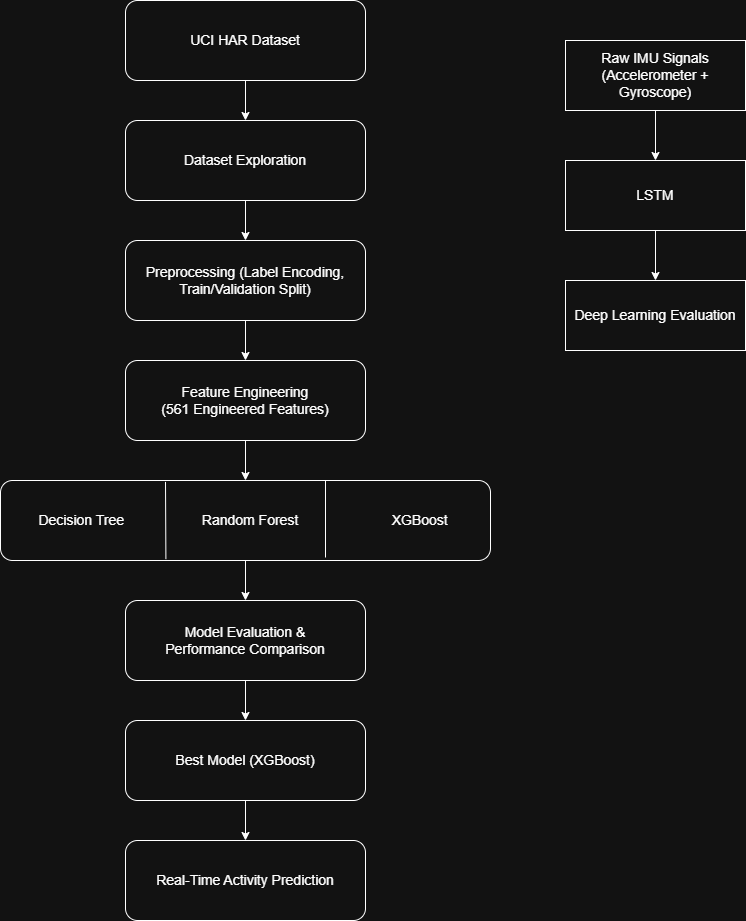
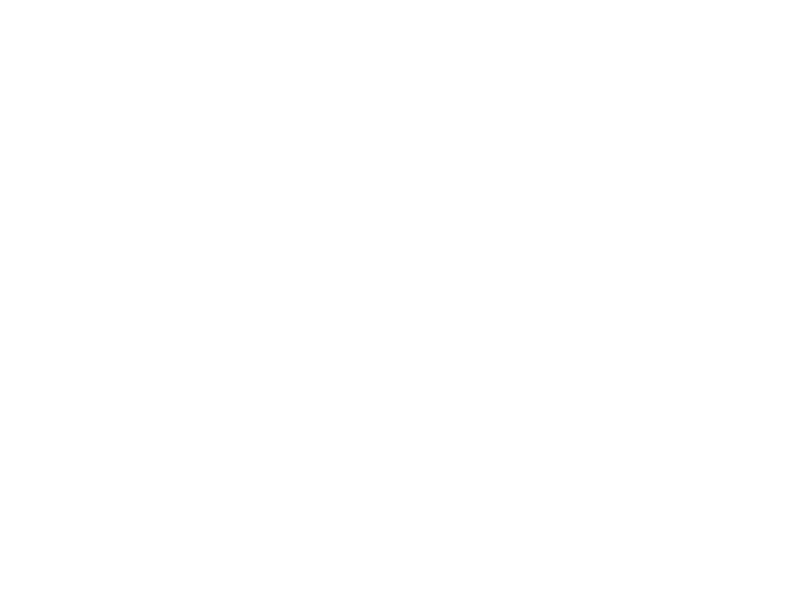
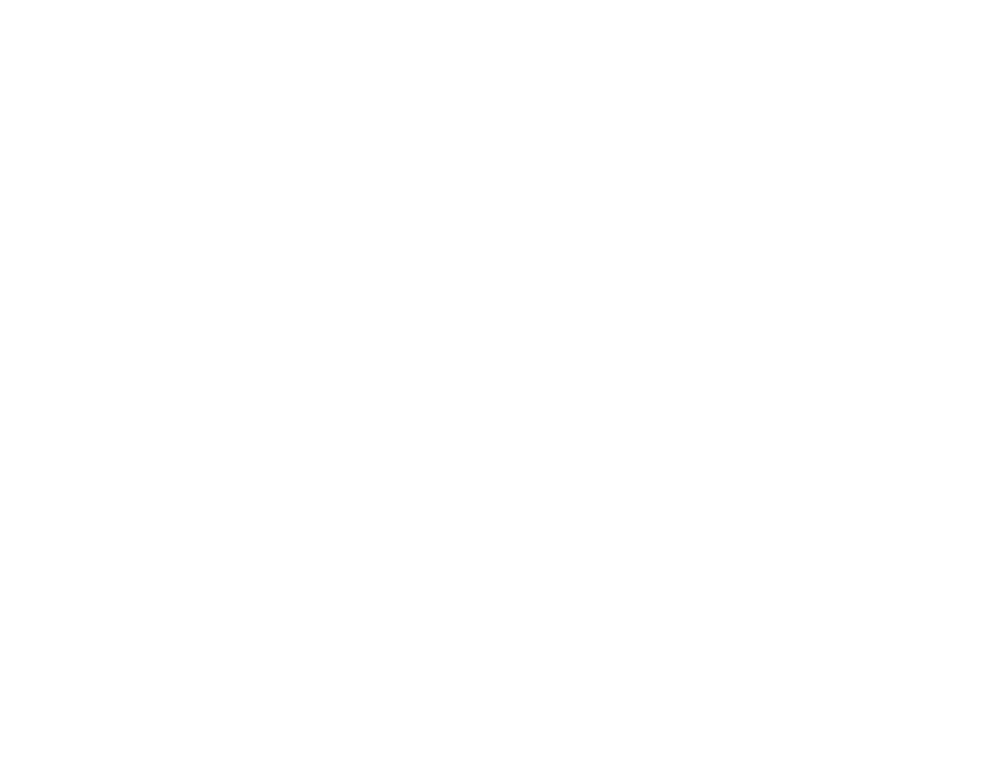
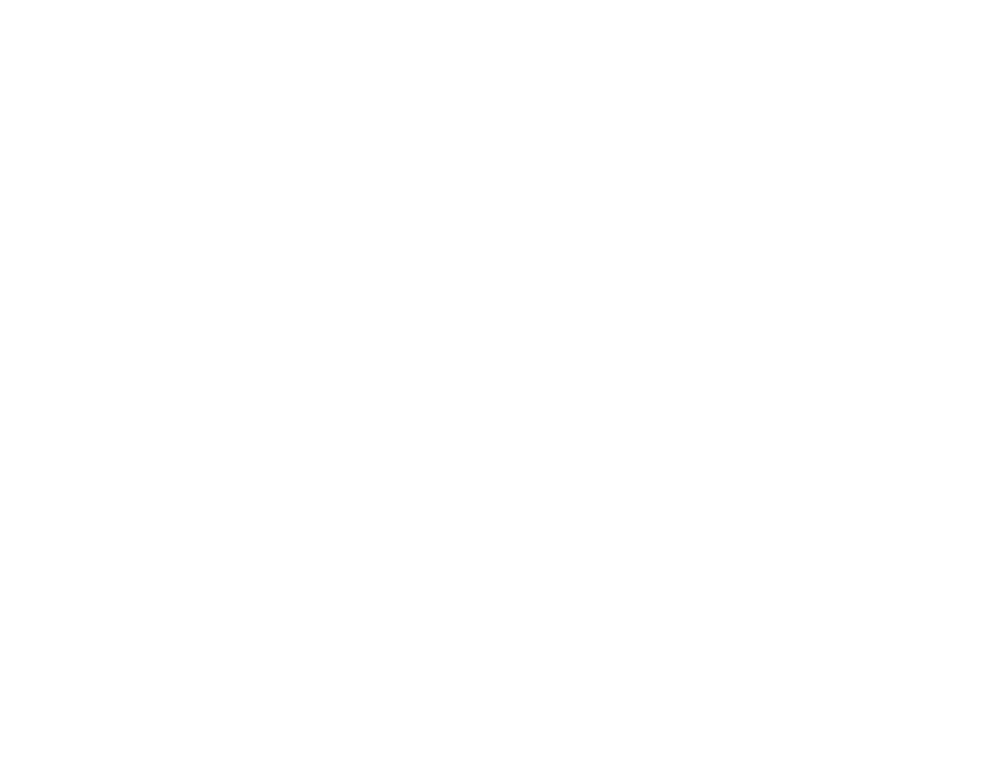
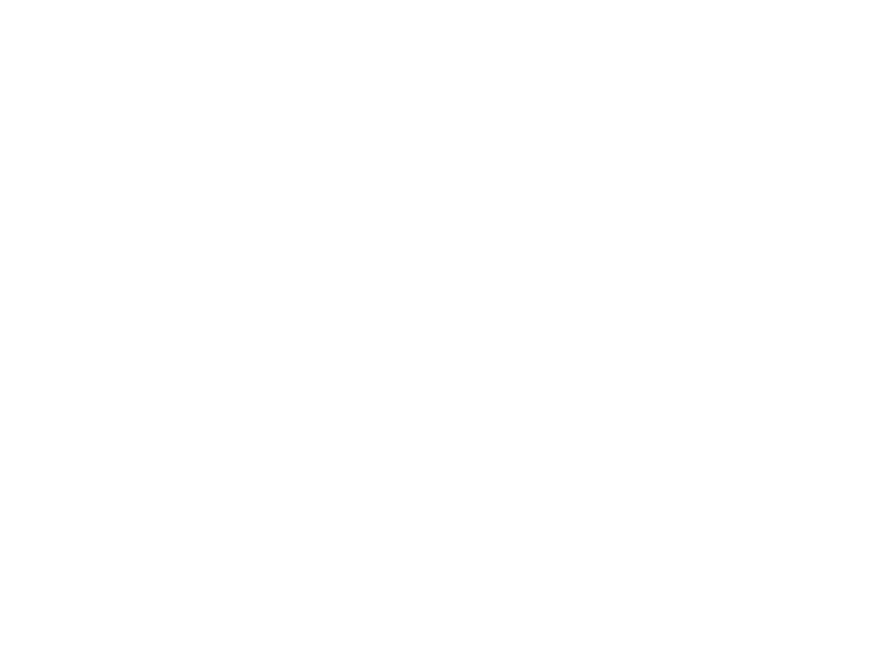
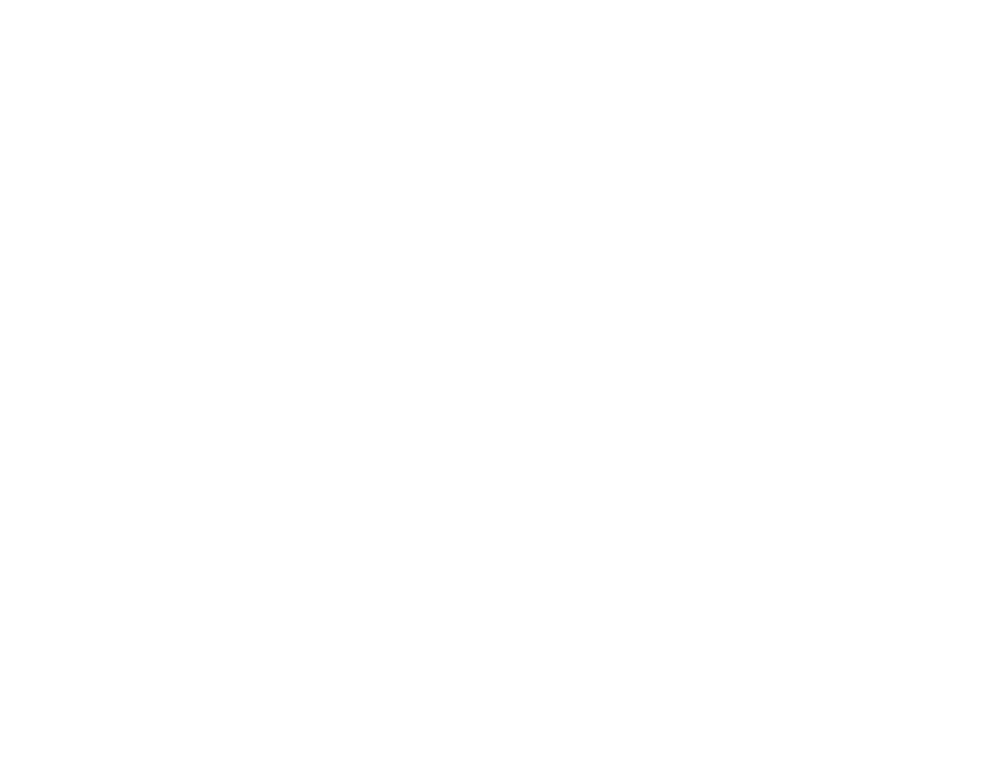
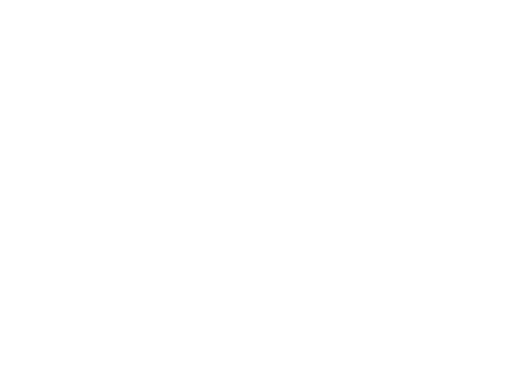

# Human Activity Recognition Using IMU Sensor Data for Smart Exoskeleton Applications

## Project Overview

This project investigates whether machine learning models can accurately recognize human activities using wearable Inertial Measurement Unit (IMU) sensor data.

The work is inspired by smart exoskeleton systems used in rehabilitation, industrial safety, posture monitoring, and assistive robotics. The goal is to develop an intelligent activity recognition pipeline capable of classifying human movements from sensor measurements collected by accelerometers and gyroscopes.

The project follows a complete machine learning workflow, including dataset exploration, preprocessing, feature analysis, dimensionality reduction, classical machine learning models, deep learning approaches, and real-time activity prediction simulation.

---

## Motivation

Human Activity Recognition (HAR) plays an important role in wearable healthcare systems, rehabilitation technologies, assistive robotics, and smart exoskeletons. Accurate recognition of movement patterns can support patient monitoring, posture correction, rehabilitation progress tracking, and worker safety applications.

This project explores how machine learning can transform wearable IMU sensor data into meaningful activity predictions that could be integrated into future intelligent exoskeleton systems.

---

## Project Architecture



---

## Research Question

Can machine learning models accurately classify human activities and postures using wearable IMU sensor data for smart exoskeleton and rehabilitation applications?

---

## Objectives

* Explore and understand wearable IMU sensor data.
* Investigate engineered feature representations for activity recognition.
* Compare multiple machine learning algorithms.
* Analyze feature importance and activity separability.
* Evaluate dimensionality reduction techniques.
* Investigate deep learning using raw sensor sequences.
* Simulate real-time activity prediction using a trained model.

---

## Dataset

Dataset: UCI Human Activity Recognition (HAR) Dataset

Activities:

1. Walking
2. Walking Upstairs
3. Walking Downstairs
4. Sitting
5. Standing
6. Laying

Sensors:

* Accelerometer
* Gyroscope

Sampling Frequency:

* 50 Hz

Feature Set:

* 561 engineered features

Raw Signal Window:

* 128 time steps
* 2.56 seconds per activity window

---

## Methodology

### Stage 1: Dataset Exploration

* Dataset inspection
* Feature understanding
* Statistical analysis
* Missing value analysis
* Duplicate value analysis

### Stage 2: Data Preprocessing

* Label encoding
* Train-validation split
* Data preparation

### Stage 3: Baseline Models

* Decision Tree
* Random Forest

### Stage 4: Visualization and Dimensionality Reduction

* PCA
* t-SNE
* Cluster separability analysis

### Stage 5: Advanced Models

* XGBoost
* Feature importance analysis
* Model comparison

### Stage 6: Raw Signal Analysis and Deep Learning

* Accelerometer signal analysis
* Gyroscope signal analysis
* LSTM model development

### Stage 7: Real-Time Activity Recognition Simulation

* Model serialization
* Model loading
* Activity prediction function
* Real-time inference simulation

---

## Results

### Model Performance Comparison

| Model         | Validation Accuracy |
| ------------- | ------------------: |
| Decision Tree |              93.68% |
| Random Forest |              98.16% |
| XGBoost       |              99.12% |
| LSTM          |              60.91% |

### Accuracy Comparison



### PCA Visualization



### t-SNE Visualization



### Decision Tree Confusion Matrix



### Random Forest Confusion Matrix



### XGBoost Confusion Matrix




### Best Performing Model

XGBoost achieved the highest validation accuracy of 99.12%.

---

## Key Findings

* XGBoost achieved the highest validation accuracy of 99.12%.
* Ensemble learning methods significantly outperformed a single Decision Tree.
* Gravity-based and orientation-related features were among the most important predictors.
* PCA preserved approximately 57% of the total variance in two dimensions.
* t-SNE revealed clear activity clusters and highlighted similarities between Sitting and Standing activities.
* Classical machine learning models outperformed the simple LSTM architecture used in this study.
* Real-time activity prediction was successfully simulated using the trained XGBoost model.

---

## Installation

Clone the repository:

```bash
git clone https://github.com/your-username/imu-har-exoskeleton-ai.git
cd imu-har-exoskeleton-ai
```

Create and activate a virtual environment:

```bash
python -m venv .venv
```

Windows:

```bash
.venv\Scripts\activate
```

Install dependencies:

```bash
pip install -r requirements.txt
```
---

## Usage

Run the notebooks in the following order:

1. 01_dataset_exploration.ipynb
2. 02_preprocessing.ipynb
3. 03_baseline_models.ipynb
4. 04_visualization_and_dimensionality_reduction.ipynb
5. 05_lstm_and_raw_signals.ipynb
6. 06_realtime_simulation.ipynb

To run the deployment simulation:

```bash
python src/realtime_simulation.py
```
---

## Repository Structure

```text
imu-har-exoskeleton-ai/

├── data/
├── models/
├── notebooks/
├── results/
├── src/
├── visuals/
├── README.md
└── requirements.txt
```

---

## Future Work

* Hyperparameter optimization
* CNN-LSTM architectures
* Real-time sensor streaming
* Exoskeleton integration
* Rehabilitation monitoring applications
* Industrial worker safety monitoring

---

## Author

Ankitha Suma Deshpande

Biomedical Engineer | Machine Learning Enthusiast | Wearable Sensing Research
